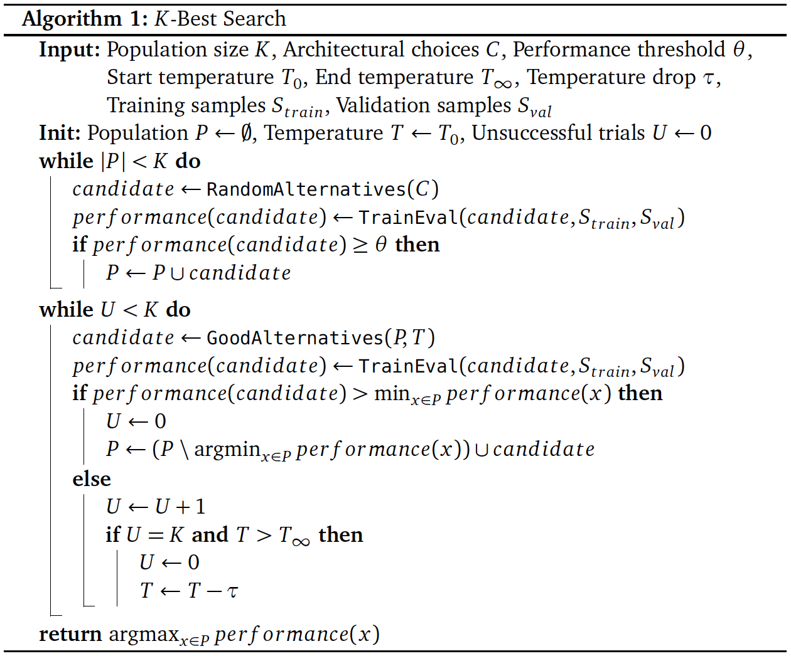

# *K*-Best Search

**A neural architecture search strategy proposed in [**"Convolutional networks for video-based infant movement analysis"**](https://ntnuopen.ntnu.no/ntnu-xmlui/handle/11250/3005688). This repository comprises the Python template and pseduocode of *K*-Best Search.**

## Python template

The Python template of *K*-Best Search is available in *kbestsearch.py*. 

To adapt *K*-Best Search to your task, make the following two modifications to *kbestsearch.py*:
1. Define the choices and associated alternatives you would like the search space to consist of by modifying the *search_space* dictionary at line 202.
2. Include in the *trainval* method (line 209) all logic required to harness the selected alternatives in *candidate* to build a machine learning model, load data relevant for your task, perform training of the model, and estimate the performance of the model on a validation set. The estimated performance should consequently be returned by the method.  

After adjusting the search space and *trainval* method in accordance with your needs, you are good to go:

```python kbestsearch.py```

## Pseudocode



## Acknowledgment

The research is performed as a collaboration between [Department of Neuromedicine and Movement Science](https://www.ntnu.edu/inb) and [Department of Computer Science](https://www.ntnu.edu/idi) at the [Norwegian University of Science and Technology](https://www.ntnu.edu/) and [Norwegian Open AI Lab](https://www.ntnu.edu/ailab). 

## Citation

In case you found this work helpful in your research, we would appreciate that you cite the following:
```
@article{groos2022convolutional,
  title={Convolutional networks for video-based infant movement analysis. Towards objective prognosis of cerebral palsy from infant spontaneous movements},
  author={Groos, Daniel},
  year={2022},
  publisher={NTNU}
}
```

## Relevant resources

- *K*-Best Search for prediction of cerebral palsy from infant spontaneous movements with graph convolutional networks: ["Development and Validation of a Deep Learning Method to Predict Cerebral Palsy From Spontaneous Movements in Infants at High Risk" (Groos et al., 2022)](https://jamanetwork.com/journals/jamanetworkopen/article-abstract/2794119) and ["Fully automated clinical movement analysis from videos using skeleton-based deep learning" (Groos et al., 2021)](https://www.sciencedirect.com/science/article/abs/pii/S0966636221003465).
